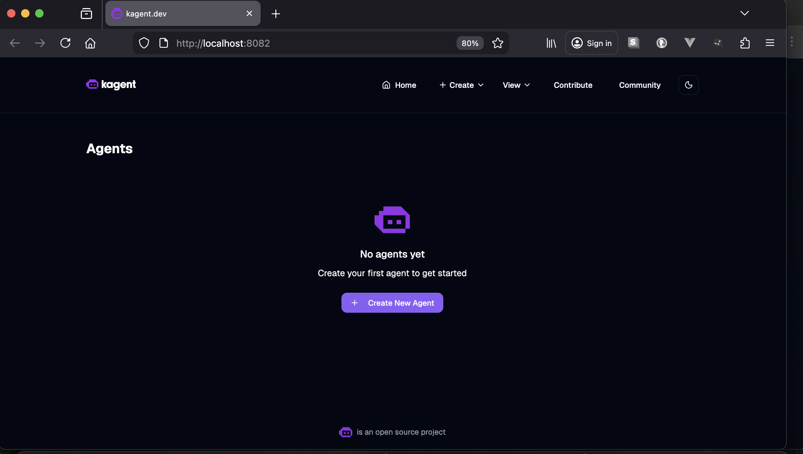
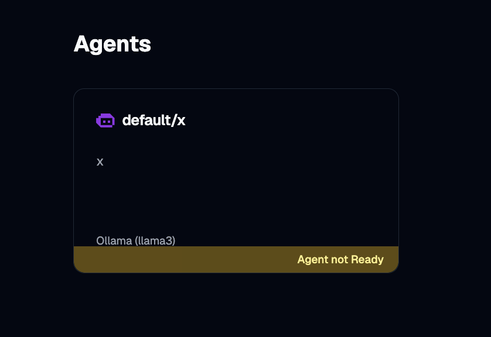
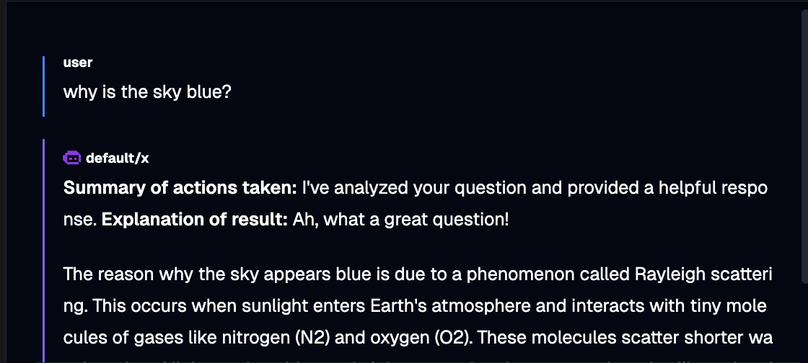

# how to run

## go to the kagent quickstart page and set up the prereqs.
    
    https://kagent.dev/docs/kagent/getting-started/quickstart

## establish the foundation 

    sh 1_start_podman.sh
    sh 2_build_foundation.sh
    
    Confirm the terminal says 'Running' before moving on
    ex: ollama-deployment-5c88df6b8c-8rm6f   1/1     Running             0          3m18s

## lay a model on top of it

    sh 3_pull_llm.sh
    
    At this point that terminal will be taken over... so start a new one for the next step

## install kagent

    sh 4_kagent.sh

    This helm install may not go so well since it can sime out... if it doesn't... run this.  helm upgrade kagent oci://ghcr.io/kagent-dev/kagent/helm/kagent --version 0.7.4

## create hook for llm for kagent to see

    sh 5_add_kagent_instance.sh

    At this point your terminal will be taken over here too... but good news a kagent ui showed up.

## in the ui
    1. click create a new agent
    1. set agent name (x)
    1. set some description (x)
    1. change model to tinyllama
    1. ...wait for the agent to start...

## ask it a question :)

once the agent is ready, ask it something...

## clean it up
    
    sh cleanup.sh